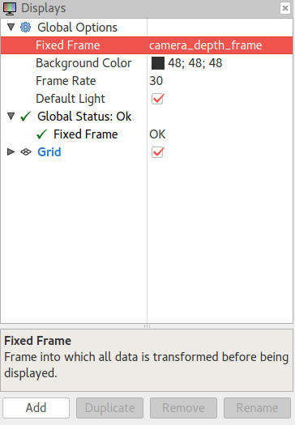

# capra_camera_3d

 Capra-Takin's **capra_camera_3d** package is a wrapper for
 a FLIR lepton camera publishing point cloud data, infrared data,
 RGB data (see **Published topics** section) to Club Capra's rescue robot.

### Dependencies

See [capra_camera_3d dependencies](doc/dependencies.md)

### Overview

For an overview on how to extend/modify this package,
see [capra_camera_3d overview](doc/overview.md)

### Usage

To interface with 3D camera in ROS, use following command:

    roslaunch capra_camera_3d capra_camera_3d.launch

After roslaunch, to check which topics are published by capra_camera_3d executable :

    rostopic list

**Published topics**

    - /camera/camera_nodelet_manager/bond
    - /camera/depth/camera_info
    - /camera/depth/image
    - /camera/depth/image/compressed
    - /camera/depth/image/compressed/parameter_descriptions
    - /camera/depth/image/compressed/parameter_updates
    - /camera/depth/image/compressedDepth
    - /camera/depth/image/compressedDepth/parameter_descriptions
    - /camera/depth/image/compressedDepth/parameter_updates
    - /camera/depth/image/theora
    - /camera/depth/image/theora/parameter_descriptions
    - /camera/depth/image/theora/parameter_updates
    - /camera/depth/image_raw
    - /camera/depth/image_raw/compressed
    - /camera/depth/image_raw/compressed/parameter_descriptions
    - /camera/depth/image_raw/compressed/parameter_updates
    - /camera/depth/image_raw/compressedDepth
    - /camera/depth/image_raw/compressedDepth/parameter_descriptions
    - /camera/depth/image_raw/compressedDepth/parameter_updates
    - /camera/depth/image_raw/theora
    - /camera/depth/image_raw/theora/parameter_descriptions
    - /camera/depth/image_raw/theora/parameter_updates
    - /camera/depth/image_rect
    - /camera/depth/image_rect/compressed
    - /camera/depth/image_rect/compressed/parameter_descriptions
    - /camera/depth/image_rect/compressed/parameter_updates
    - /camera/depth/image_rect/compressedDepth
    - /camera/depth/image_rect/compressedDepth/parameter_descriptions
    - /camera/depth/image_rect/compressedDepth/parameter_updates
    - /camera/depth/image_rect/theora
    - /camera/depth/image_rect/theora/parameter_descriptions
    - /camera/depth/image_rect/theora/parameter_updates
    - /camera/depth/image_rect_raw
    - /camera/depth/image_rect_raw/compressed
    - /camera/depth/image_rect_raw/compressed/parameter_descriptions
    - /camera/depth/image_rect_raw/compressed/parameter_updates
    - /camera/depth/image_rect_raw/compressedDepth
    - /camera/depth/image_rect_raw/compressedDepth/parameter_descriptions
    - /camera/depth/image_rect_raw/compressedDepth/parameter_updates
    - /camera/depth/image_rect_raw/theora
    - /camera/depth/image_rect_raw/theora/parameter_descriptions
    - /camera/depth/image_rect_raw/theora/parameter_updates
    - /camera/depth/points
    - /camera/depth_rectify_depth/parameter_descriptions
    - /camera/depth_rectify_depth/parameter_updates
    - /camera/depth_registered/camera_info
    - /camera/depth_registered/image_raw
    - /camera/depth_registered/image_raw/compressed
    - /camera/depth_registered/image_raw/compressed/parameter_descriptions
    - /camera/depth_registered/image_raw/compressed/parameter_updates
    ⁻ /camera/depth_registered/image_raw/compressedDepth
    - /camera/depth_registered/image_raw/compressedDepth/parameter_descriptions
    - /camera/depth_registered/image_raw/compressedDepth/parameter_updates
    - /camera/depth_registered/image_raw/theora
    - /camera/depth_registered/image_raw/theora/parameter_descriptions
    - /camera/depth_registered/image_raw/theora/parameter_updates
    - /camera/depth_registered/points
    - /camera/depth_registered/sw_registered/camera_info
    - /camera/depth_registered/sw_registered/image_rect
    - /camera/depth_registered/sw_registered/image_rect/compressed
    - /camera/depth_registered/sw_registered/image_rect/compressed/parameter_descriptions
    - /camera/depth_registered/sw_registered/image_rect/compressed/parameter_updates
    - /camera/depth_registered/sw_registered/image_rect/compressedDepth
    - /camera/depth_registered/sw_registered/image_rect/compressedDepth/parameter_descriptions
    - /camera/depth_registered/sw_registered/image_rect/compressedDepth/parameter_updates
    - /camera/depth_registered/sw_registered/image_rect/theora
    - /camera/depth_registered/sw_registered/image_rect/theora/parameter_descriptions
    - /camera/depth_registered/sw_registered/image_rect/theora/parameter_updates
    - /camera/depth_registered/sw_registered/image_rect_raw
    - /camera/depth_registered/sw_registered/image_rect_raw/compressed
    - /camera/depth_registered/sw_registered/image_rect_raw/compressed/parameter_descriptions
    - /camera/depth_registered/sw_registered/image_rect_raw/compressed/parameter_updates
    - /camera/depth_registered/sw_registered/image_rect_raw/compressedDepth
    - /camera/depth_registered/sw_registered/image_rect_raw/compressedDepth/parameter_descriptions
    - /camera/depth_registered/sw_registered/image_rect_raw/compressedDepth/parameter_updates
    - /camera/depth_registered/sw_registered/image_rect_raw/theora
    - /camera/depth_registered/sw_registered/image_rect_raw/theora/parameter_descriptions
    - /camera/depth_registered/sw_registered/image_rect_raw/theora/parameter_updates
    - /camera/driver/parameter_descriptions
    - /camera/driver/parameter_updates
    - /camera/ir/camera_info
    - /camera/ir/image
    - /camera/ir/image/compressed
    - /camera/ir/image/compressed/parameter_descriptions
    - /camera/ir/image/compressed/parameter_updates
    - /camera/ir/image/compressedDepth
    - /camera/ir/image/compressedDepth/parameter_descriptions
    - /camera/ir/image/compressedDepth/parameter_updates
    - /camera/ir/image/theora
    - /camera/ir/image/theora/parameter_descriptions
    - /camera/ir/image/theora/parameter_updates
    - /camera/rgb/camera_info
    - /camera/rgb/image_raw
    - /camera/rgb/image_raw/compressed
    - /camera/rgb/image_raw/compressed/parameter_descriptions
    - /camera/rgb/image_raw/compressed/parameter_updates
    - /camera/rgb/image_raw/compressedDepth
    - /camera/rgb/image_raw/compressedDepth/parameter_descriptions
    - /camera/rgb/image_raw/compressedDepth/parameter_updates
    - /camera/rgb/image_raw/theora
    - /camera/rgb/image_raw/theora/parameter_descriptions
    - /camera/rgb/image_raw/theora/parameter_updates
    - /camera/rgb/image_rect_color
    - /camera/rgb/image_rect_color/compressed
    - /camera/rgb/image_rect_color/compressed/parameter_descriptions
    - /camera/rgb/image_rect_color/compressed/parameter_updates
    - /camera/rgb/image_rect_color/compressedDepth
    - /camera/rgb/image_rect_color/compressedDepth/parameter_descriptions
    - /camera/rgb/image_rect_color/compressedDepth/parameter_updates
    - /camera/rgb/image_rect_color/theora
    - /camera/rgb/image_rect_color/theora/parameter_descriptions
    - /camera/rgb/image_rect_color/theora/parameter_updates
    - /camera/rgb_rectify_color/parameter_descriptions
    - /camera/rgb_rectify_color/parameter_updates
    - /tf
    - /tf_static

**rviz**

If rviz isn't installed, install rviz :

    sudo apt-get install ros-kinetic-rviz

Launch rviz with command :

    rviz
  
In rviz graphical interface :
  
  Under Global Options, changed the Fixed Frame to one of the following :
    
    - camera_depth_frame
    - camera_depth_optical_frame
    - camera_link
    - camera_rgb_frame
    - camera_rgb_optical_frame

  Global Status should be "Global Status: Ok" with "Fixed Frame OK"
  
  
  
  In rviz graphical interface :
  
    - Click on "Add" button below in the "Displays" left pane
    - In popup window, choose tab "by topic"
    - Choose topic to subscribe to and visualize camera data
    
  
  
**Failed to open USB device**

Based on this thread https://3dclub.orbbec3d.com/t/orbbec-openi-problem-with-usb/279/6

If you have issues with opening the camera:

 * Generate a file with the name orbbec-usb.rules
 * add to the file: SUBSYSTEM=="usb", ATTR{idProduct}=="0404", ATTR{idVendor}=="2bc5", MODE:="0666", OWNER:="root", GROUP:="video"
 * sudo cp orbbec-usb.rules /etc/udev/rules.d/
 * unplug the camera
 * udevadm control --reload-rules
 * plug the camera
 
