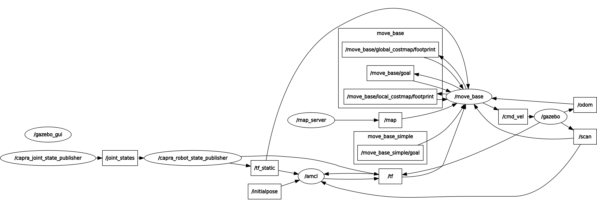
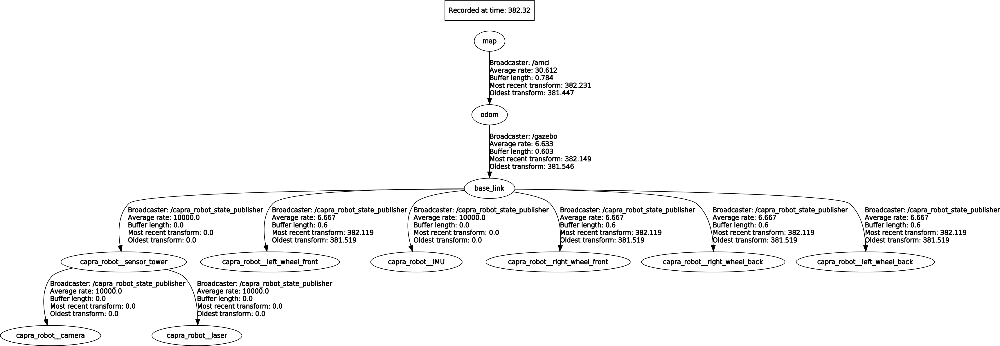
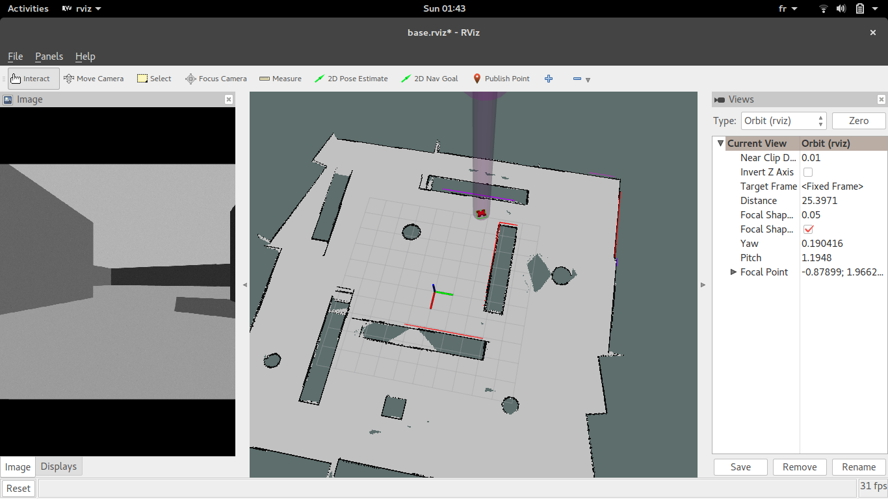
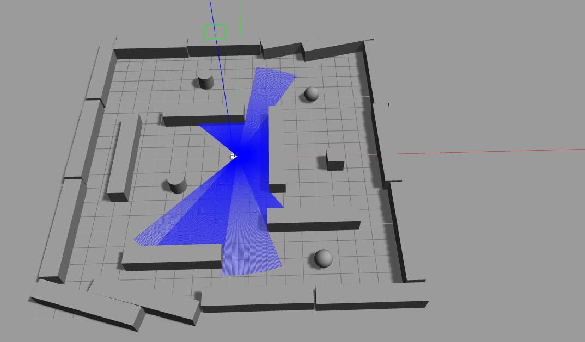

# capra_simulation

Capra-Takin's **capra_simulation** package is the Gazebo to ROS interfacing
stack for autonomous robot simulation.

### Dependencies

See [capra_simulation dependencies](doc/dependencies.md)

### Overview

For an overview of how to extend this package, see [capra_simulation overview](doc/overview.md)

### Usage

$ *roslaunch capra_simulation simulation.launch*

By default, the launch files will open the Gazebo GUI and rviz GUI.

Use rviz to send 2d Nav Goals to the robot and watch automatic navigation unfold.

For more information on how to use rviz, see http://wiki.ros.org/rviz/UserGuide 

### Published/Subscribed Topics

### tf

### rviz

### Gazebo

