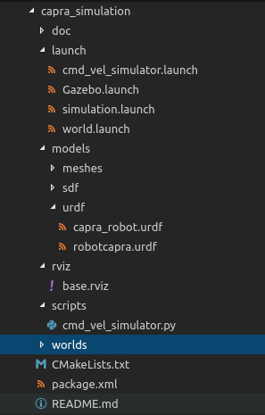

## Package capra_simulation Overview

### Package file hierarchy

### The launch folder

The launch folder contains mostly gazebo-ros interfacing nodes. 
The important ones to consider are the Gazebo.launch and
simulation.launch launch files.

#### simulation.launch :

This launch file is where you can modify and override the overrideable
arguments from its nested launch files. See below for overrideable arguments
in capra_simulation-related launch files or see [capra_navigation package](../capra_navigation/doc/overview.md) for
overrideable arguments in capra_navigation-related launch files.
simulation.launch launches the complete simulation suite.

argument overriding example :

<pre><code>&lt;include file="$(find capra_simulation)/launch/Gazebo.launch"&gt; 
         &lt;arg name="world_name" value="<your-world-file-name>.world" /&gt; 
         &lt;arg    name="robot_description"
            value="$(find capra_simulation)/models/urdf/<your-other-robot-file>.urdf" /&gt; 
&lt;/include&gt; </code></pre>

launching example (considering workspace has been sourced) : 

`roslaunch capra_simulation simulation.launch`

Nested launches :
- Gazebo.launch
- capra_configuration.launch (from capra_navigation package)
- navigation_stack.launch (from capra_navigation package)

Spawned nodes :
- static_transform_publisher
- rviz

Environment :
- GAZEBO_RESOURCE_PATH (we append the worlds/ folder to the GAZEBO_RESOURCE_PATH environment variable)

#### Gazebo.launch :

Nested launches : 
- world.launch
- capra_odometry_simulation.launch

Spawned nodes :
- spawn_urdf (from external gazebo-ros package)

Overrideable args :
- robot_description : default is robotcapra.urdf of capra_simulation's models/urdf folder
- gui : default is true (opens gazebo visualization if set to true)
- initial_position : default is (0, 0, 0) in (x,y,z) and (0, 0, 0) for (roll, pitch, yaw)
- world_name : default is random.world in capra_simulation's worlds folder

#### world.launch :

The world.launch launch file is an almost identical copy of the gazebo-ros
package's empty_world.launch launch file. See the gazebo-ros package for
more info.

Overrideable args (only the most used ones) : 

- paused : default is false, set to true to start simulation in paused mode
- gui : default is true, set to true to open gazebo visualization
- recording : default is false, set to true to record (TODO : complete doc)
- debug : default is false, set to true for debugging information
- physics : default is ODE, can set to any other gazebo supported physics engine
- verbose : default is false, set to true to see gazebo messages stream in the console
- world_name : default is man1.world, set value to any other valid .world file
